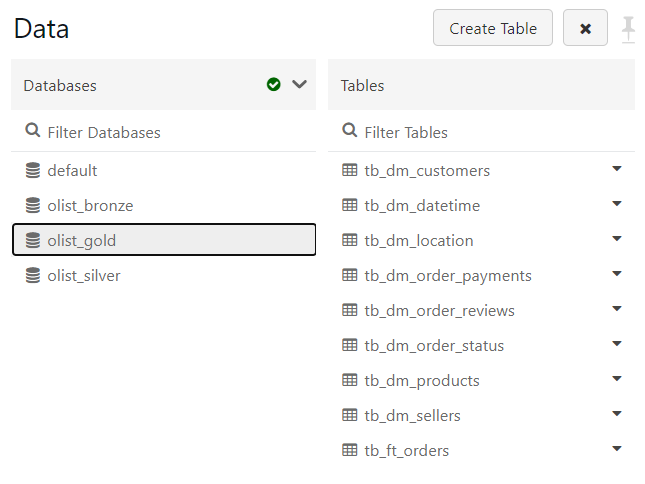

# Análise de dados no Power BI do dataset de e-commerce da Olist, a partir de ETL no Databricks

## Apresentação:
Este projeto realiza o estudo de uma base de dados pública da Olist Store, amplamente conhecida plataforma de soluções de e-commerce, a partir do desenvolvimento de todas as etapas de um fluxo de análise de dados, desde a extração do dado de origem até a sua visualização final.

A base de dados é disponibilizada pela plataforma Kaggle. A etapa do ETL é realizada no Databricks, com a estrutura de camadas bronze, silver e gold, e utilizando as linguagens de programação Python e SQL. E o painel com a visualização dos dados é apresentado no Power BI. A partir da imagem a seguir, é possível visualizar o esquema da arquitetura do fluxo do dado.

## Informações sobre a base de dados:
Nossa base de dados foi obtida por meio da plataforma Kaggle, que distribui de forma livre e gratuita bases de dados para estudo, projetos e competições internas, e é composta por dados reais do e-commerce da plataforma Olist. Essa base tem informações de cerca de 100 mil pedidos realizados entre os anos de 2016 e 2018, de diversos marketplaces no Brasil, com dados de clientes, vendedores, produtos, avaliações de pedidos e mais. Para obter informações mais detalhadas e acessar a base publicada, segue link: <https://www.kaggle.com/datasets/olistbr/brazilian-ecommerce/>

Para uma melhor compreensão inicial da base de dados, segue uma breve descrição do que contém em cada arquivo de origem:
* **olist_customer_dataset** - lista os clientes e a localização de cada. O campo customer_id é um id único criado para cada customer em cada compra, logo o mesmo customer poderá ter mais de um customer_id associado, caso tenha realizado mais de uma compra. Já o customer_unique_id é o id que referencia cada cliente unicamente.
* **olist_geolocation_dataset** - localização geográfica, prefixo de cep, cidade e estado.
* **olist_order_items_dataset** - lista os produtos de cada pedido, o vendedor responsável, valores e a data limite de entrega.
* **olist_order_payments_dataset** - tipo do pagamento utilizado em cada compra, número de parcelas e valor.
* **olist_order_reviews_dataset** - nota de avaliação e comentário do cliente para a compra realizada, data de criação e data de resposta.
* **olist_orders_dataset** - lista os pedidos realizados, com indicação do cliente, status do pedido e a data/hora da compra, da confirmação do pagamento, do envio do pedido, da entrega ao cliente e da estimativa de entrega.
* **olist_products_dataset** - lista os produtos vendidos, nome, descrição, quantidade de fotos, peso, dimensões e nome da categoria de cada produto.
* **olist_sellers_dataset** - lista os vendedores e a localização de cada.
* **product_category_name_translation** - tradução para o inglês dos nomes das categorias de produtos, presentes no arquivo olist_products_dataset em português.

O esquema de dados original possui a seguinte composição:

## ETL no Databricks:
O Databricks foi escolhido por ser uma plataforma de notebooks, que suporta diversas linguagens de programação e permite a criação de fluxos de trabalho unificados e automatizados, o que auxilia o processo de modelagem de dados. Com isso, foi construído um padrão de design de dados conhecido como "arquitetura medalhão", que é usado para direcionar logicamente os dados, com o intuito de individualizar as principais etapas e realizar uma melhoria incremental e progressiva, à medida que o dado flue através de cada camada. As camadas são definidas como Bronze, Silver e Gold, e são equivalentes as camadas conhecidas por Raw, Stage e Final, respectivamente, que são nomenclaturas já popularizadas em projetos de dados. 

A descrição do que foi feito em cada camada é apresentada a seguir, com uma explicação inicial do passo a passo tomado e das decisões aplicadas, seja da extração dos dados de origem, do tratamento e limpeza dos dados ou da modelagem definida. Vale a pena ressaltar que explicações mais detalhadas do código se encontram ao longo dos notebooks, por meio de comentários e títulos das células de código.

### 1. Camada Bronze

A camada bronze é responsável por transformar em tabelas os arquivos csv do dataset, que foram previamente importados para o storage do Databricks. Para isso, criamos um banco de dados nomeado de olist_bronze e executamos um código em Python que vai rodar em loop, fazendo a leitura de cada arquivo até que todas as tabelas sejam criadas. Também foi adicionado o código de execução individual de cada tabela, para caso se necessite fazer desta forma. O notebook pode ser executado via botão "Run all", para a opção de criação das tabelas automaticamente pelo loop, e irá parar ao chegar no comando de exit. A imagem abaixo ilustra o catálogo de dados com as tabelas criadas ao fim da execução, uma para cada arquivo de origem.

### 2. Camada Silver
A camada silver é responsável por realizar todo o tratamento e limpeza dos dados. Nela, temos a criação do banco de dados olist_silver e tratamos cada arquivo oriundo da camada bronze individualmente, passando por cada campo analisando quais tratamentos serão necessários. Essas análises se dão por consultas em SQL, com uma investigação minunciosa do dado de origem a procura de anomalias, erro de formatação, erro de escrita, tipo de dado inapropriado, eliminação de nulos e realização de "de-paras", quando se faz necessário. Por fim, é criada a tabela stage com todos os tratamentos aplicados e alguns relacionamentos entre tabelas feitos. A imagem a seguir ilustra as tabelas criadas na camada silver.

### 3. Camada Gold
Por fim, a camada gold é responsável pela criação das tabelas fato e dimensão, que compõem o schema estrela que pretendemos criar. A partir da criação do banco de dados olist_gold, são criadas cada tabela ft (fato) ou dm (dimensão), conforme sua configuração no modelo de dados, e realizados alguns testes de validação, como o de identificação de id's repetidos, o que é de suma importância para criarmos as chaves primárias únicas. Também é nesta camada que novas configurações de tabelas são realizadas, a partir da normalização dos dados, construção de novos relacionamentos, e eliminação de dados que não terão uso, tudo para que vá se construindo uma modelagem no formato estrela ou snowflake, que são os schemas mais apropriados para uso no Power BI, segundo recomendação da plataforma. Por último, temos uma seção extra que foi criada para a realização de testes de homologação dos dados apresentados no Power BI, para que se tenha uma validação das métricas, KPI's e gráficos construídos. A imagem a seguir ilustra as tabelas fato e dimensão criadas na camada gold.

Após a finalização das três camadas de dados no Databricks, foram importadas todas as tabelas da última camada (Gold) para dentro do Power BI para que se inicie a próxima etapa, a construção do Data Visualization.

## Data Visualization no Power BI

